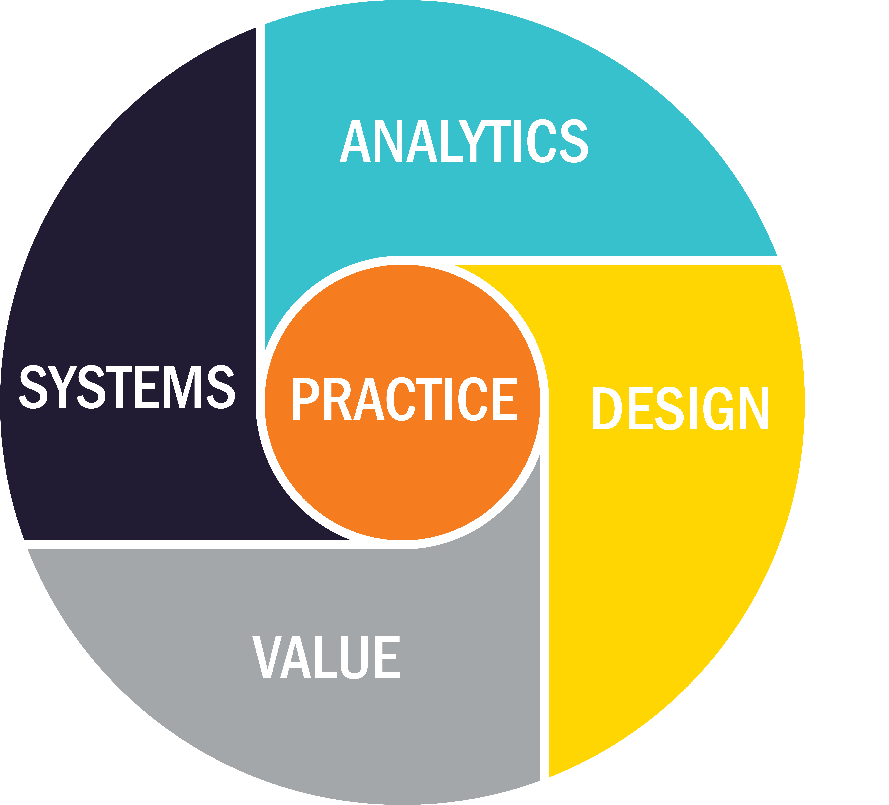

# DS2002 Programming for Data Science

**University of Virginia School of Data Science**{: .fs-6 .fw-300 }

By definition, "data science" must make meaning out of ever-growing pools of data. But the researcher quickly discovers that the hand examination of any data, while useful for granular analysis, is never adequate for large samples. To produce data science at scale, researchers must make effective use of workflows, pipelines, and processes to ingest, parse, and transform data with tools and automation.

This course will center on exposing students to contemporary pipelines for data analysis through a series of steadily escalating use cases. The course will begin with simple local database construction and evolve to cloud-based infrastructure such as AWS or Google Cloud. This progression will include learning a variety of systems for data collection, orchestration, transformation, consumption, and others as appropriate.Links to an external site.

## Course Details for Spring 2023:

### Class Meetings

- Times: Monday / Wednesday 2:00 PM to 2:50 PM Friday is Lab Day
- Location: [Dell 105](https://atlas.fm.virginia.edu/portal/apps/webappviewer/index.html?id=c54aefa568904e018601a0447eb722bf&marker=-78.51000841727834%2C38.03486767781649%2C%2C%2C%2C&markertemplate=%7B%22title%22%3A%22Dell%20Building%20%231%20%22%2C%22longitude%22%3A-78.51000841727834%2C%22latitude%22%3A38.03486767781649%2C%22isIncludeShareUrl%22%3Atrue%7D&level=18)
- Dates: August 23, 2023 — December 4, 2023

### Instructor

- Name: Jason Williamson
- Email: [jpw4ma@virginia.edu](mailto:jpw4map@virginia.edu)
- Office: [3 Elliewood Ave, Charlottesville, VA 22903 --Above Ragged Mtn](https://www.google.com/maps/place/UVA+School+of+Data+Science/@38.0356302,-78.5031408,17z/data=!3m1!4b1!4m6!3m5!1s0x89b387edba9272d3:0xee426c4650d17e63!8m2!3d38.0356302!4d-78.5005659!16s%2Fg%2F11fqxxbqg_?entry=ttu)
- Office Hours: Mondays 12:00 PM to 2:00 PM. Other times by appointment.

### Teaching Assistant

- Name: Matthew Samuel
- Email: [uar6nw@virginia.edu](mailto:uar6nw@virginia.edu)
- Office Hours: 1:00-2:30pm Mondays in Dell 1, at the table near the video wall.

This syllabus is subject to change without announcement.
